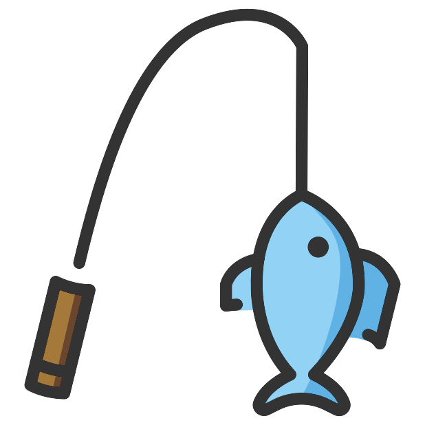

<!-- Begin README -->

    

 

    
     
    
    
    
     
    

---------------

<h1 align="center">🎣🐟 API Data Fisher 🐟🎣</h1>

The data fisher is a single page web application that calls multiple `API` endpoints and returns the data in a `CSV` format.

    
     
    <i>Application Preview</i>

---------------

## Table of Contents

- [Features](#features)
- [Getting Started](#getting-started)
    - [Dependencies](#dependencies)
    - [Configuration](#configuration)
    - [Installation](#installation)
    - [Usage](#usage)
    - [Error Handling](#error-handling)
    - [Tested With](#tested-with)
- [What's Inside?](#whats-inside)
- [Attribution](#attribution)
- [Resources](#resources)
- [License](#license)
- [Credits](#credits)

## Features

- Calls multiple `API` endpoints and returns the data in a `CSV` format.
- Allows you to specify the groups you want to use to call the `API` endpoints.
- Allows you to specify the sample groups you want to use to call the `API` endpoints.
- Allows you to specify the `API` key/credentials and the end point you want to call.
- Allows you to start and stop the data retrieval process.
- Allows you to download the data as a `CSV` file.

## Getting Started

Below are the instructions for getting the data fisher up and running on your local machine.

### Dependencies

- [PapaParse 5.3.0](https://www.papaparse.com/)

### Configuration

- `data/groups.js` - Contains the groups that will be used to call the `API` endpoints.
   - Update `groupIDs` array with the groups you want to use. This should contain *ALL* the groups you want to use.
   - Update `groupIDsTest` array with the sample groups you want to use. This should contain *ONLY* the handful of sample groups you want to use.
- `config/config.js` - Contains the configuration for the data fisher.
   - Update `config` object with your `API` key/credentials and the end point you want to call.
   - Update `useTestGroups` to `true` if you want to use the sample groups array `groupIDsTest` in `data/groups.js`. Otherwise, set it to `false` to use the groups array `groupIDs` in `data/groups.js`.

### Installation

1. Clone the repository.
2. Open the `data_fisher.html` web page in a browser.
3. Click on *Start Fishing for Data* button to start the data retrieval process.
4. When the data retrieval process is complete, the data will be downloaded as a `CSV` file in your browser.

> [!IMPORTANT]
> This application was built with the intention of being run locally on your machine (and any machine since most browsers are supported being that it is built with `HTML`, `CSS`, and `JavaScript`). If you want to deploy this application to a server, you will need to make some changes to the code to allow for cross-origin resource sharing (CORS) and to allow for the download of the `CSV` file.

### Usage

1. Open the `data_fisher.html` web page in a browser.
2. Click on *Start Fishing for Data* button to start the data retrieval process.
3. When the data retrieval process is complete, the data will be downloaded as a `CSV` file in your browser.
4. Click on *Stop Fishing for Data* button to stop the data retrieval process.
    - Note: The data retrieval process will stop automatically when all the `API` endpoints have been called and you will not be able to download the data as a `CSV` file until you start the data retrieval process again.

### Error Handling

- If an error occurs while calling an `API` endpoint, the error will be logged in the console and displayed in the *Errors* section of the web page.
- Troubleshoot the error and refresh the page to try the data retrieval process again.

### Tested With
- [Chrome 117.0.5938.92](https://www.google.com/chrome/)

## What's Inside?

- `data_fisher.html` - The main web page that contains the data fisher.
- `js/app.js` - The main JavaScript file that contains the logic for the data fisher.
- `config/config.js` - The configuration file that contains the configuration for the data fisher.
- `data/groups.js` - The file that contains the groups that will be used to call the `API` endpoints.
- `images/` - The folder that contains the images used in the data fisher.
- `css/styles.css` - The CSS file that contains the styles for the data fisher.

## Attribution
All emojis designed by [OpenMoji](https://openmoji.org/) – the open-source emoji and icon project. License: [CC BY-SA 4.0](https://creativecommons.org/licenses/by-sa/4.0/#)

## Resources

- [PapaParse 5.3.0](https://www.papaparse.com/) - Papa Parse is a powerful, in-browser CSV (Comma-Separated Values) parser for JavaScript. It's designed to handle various types of CSV data efficiently and provides a simple interface for parsing CSV files or strings in the client-side environment. Papa Parse is widely used in web applications to read and process CSV files, especially when dealing with large datasets or files.
- [OpenMoji](https://openmoji.org/) - OpenMoji is the open-source emoji and icon project. License: [CC BY-SA 4.0](https://creativecommons.org/licenses/by-sa/4.0/#)
- [JavaScript Documentation](https://developer.mozilla.org/en-US/docs/Web/JavaScript) - `JavaScript` is a lightweight, interpreted, object-oriented language with first-class functions, and is best known as the scripting language for Web pages, but it's used in many non-browser environments as well.
- [HTML Documentation](https://developer.mozilla.org/en-US/docs/Web/HTML) - `HTML` is the language for describing the structure of Web pages.
- [CSS Documentation](https://developer.mozilla.org/en-US/docs/Web/CSS) - `CSS` is a language that describes the style of an `HTML` document.
- [Visual Studio Documentation](https://docs.microsoft.com/en-us/visualstudio/) - Visual Studio is an integrated development environment (IDE) from Microsoft. It is used to develop computer programs, as well as websites, web apps, web services and mobile apps.
- [Chrome Developer Tools Documentation](https://developer.chrome.com/docs/devtools/) - Chrome DevTools is a set of web developer tools built directly into the Google Chrome browser. DevTools can help you edit pages on-the-fly and diagnose problems quickly, which ultimately helps you build better websites, faster.
- [Google Chrome Documentation](https://developers.google.com/web/tools/chrome-devtools) - Google Chrome is a cross-platform web browser developed by Google. It was first released in 2008 for Microsoft Windows, and was later ported to Linux, macOS, iOS, and Android.

## License

This project is released under the terms of the **MIT License**, which permits use, modification, and distribution of the code, subject to the conditions outlined in the license.
- The [MIT License](https://choosealicense.com/licenses/mit/) provides certain freedoms while preserving rights of attribution to the original creators.
- For more details, see the [LICENSE](LICENSE) file in this repository. in this repository.

## Credits

**Author:** [Scott Grivner](https://github.com/scottgriv)  
**Email:** [scott.grivner@gmail.com](mailto:scott.grivner@gmail.com)  
**Website:** [scottgrivner.dev](https://www.scottgrivner.dev)  
**Reference:** [Main Branch](https://github.com/scottgriv/uwp-audio_recorder)  

---------------

    

<!-- End README -->